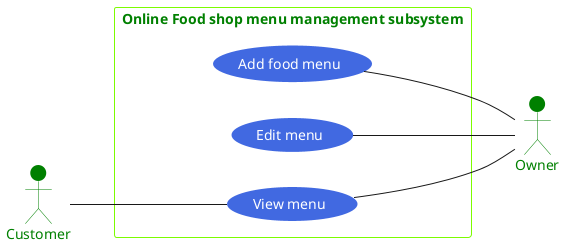

```puml
@startuml home2
left to right direction
skinparam rectangle{
    BorderColor LawnGreen
    FontColor Green
}
skinparam actor{
    BackgroundColor Green
    BorderColor Green
    FontColor Green
}
actor Customer
actor Owner
rectangle "Online Food shop menu management subsystem"{
    (Add food menu)--Owner
    (Edit menu)--Owner
    (View menu)--Owner
    Customer--(View menu)
}
skinparam usecase {
    BackgroundColor RoyalBlue
    BorderColor RoyalBlue
    FontColor white
    ArrowColor RoyalBlue
}
@enduml
```