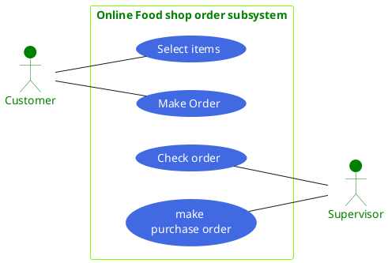

```puml
@startuml home3
left to right direction
skinparam rectangle{
    BorderColor LawnGreen
    FontColor Green
}
skinparam actor{
    BackgroundColor Green
    BorderColor Green
    FontColor Green
}
actor Supervisor
actor Customer
rectangle "Online Food shop order subsystem"{

    Customer--(Select items)
    Customer--(Make Order)
    (Check order)--Supervisor
    (make \npurchase order)--Supervisor

}
skinparam usecase {
    BackgroundColor RoyalBlue
    BorderColor RoyalBlue
    FontColor white
    ArrowColor RoyalBlue
}
@enduml
```