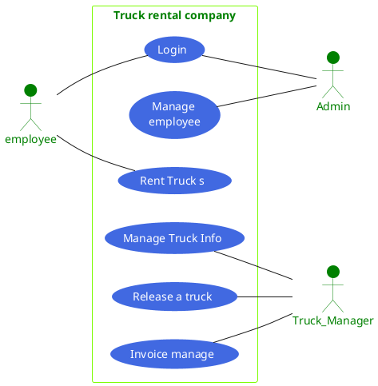

```puml
@startuml home4
left to right direction
skinparam rectangle{
    BorderColor LawnGreen
    FontColor Green
}
skinparam actor{
    BackgroundColor Green
    BorderColor Green
    FontColor Green
}
actor employee
actor Admin
actor Truck_Manager
rectangle "Truck rental company"{
    employee--(Login)
    (Login)--Admin
    (Manage \nemployee)--Admin
    employee--(Rent Truck s)
    (Manage Truck Info)--Truck_Manager
    (Release a truck)--Truck_Manager
    (Invoice manage)--Truck_Manager
}
skinparam usecase {
    BackgroundColor RoyalBlue
    BorderColor RoyalBlue
    FontColor white
    ArrowColor RoyalBlue
}
@enduml
```