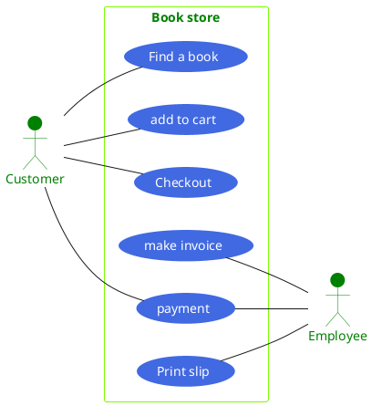

```puml
@startuml home3
left to right direction
skinparam rectangle{
    BorderColor LawnGreen
    FontColor Green
}
skinparam actor{
    BackgroundColor Green
    BorderColor Green
    FontColor Green
    
}
actor Employee
actor Customer
rectangle "Book store"{
    Customer--(Find a book)
    Customer--(add to cart)
    Customer--(Checkout)
    (make invoice)--Employee
    Customer--(payment)
    (payment)--Employee
    (Print slip)--Employee
}
skinparam usecase {
    BackgroundColor RoyalBlue
    BorderColor RoyalBlue
    FontColor white
    ArrowColor RoyalBlue
}
@enduml
```