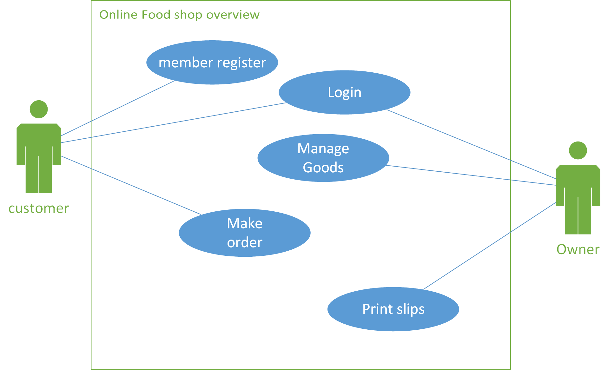
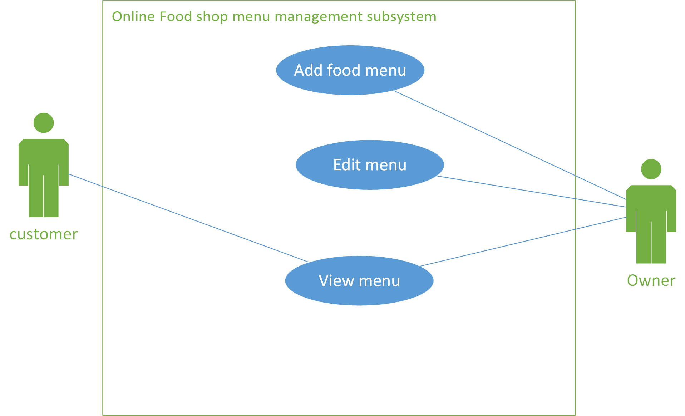

# การบ้านเรื่องการวาด usecase diagram
## ข้อที่ 1 ระบบจัดการร้านอาหาร
### 1.1 ให้เขียน code ด้วยภาษา plantuml เพื่อสร้าง use case diagram ที่มีหน้าตาดังนี้

### 1.2 ให้เขียน code ด้วยภาษา plantuml เพื่อสร้าง use case diagram ที่มีหน้าตาดังนี้

### 1.2 ให้เขียน code ด้วยภาษา plantuml เพื่อสร้าง use case diagram ที่มีหน้าตาดังนี้

